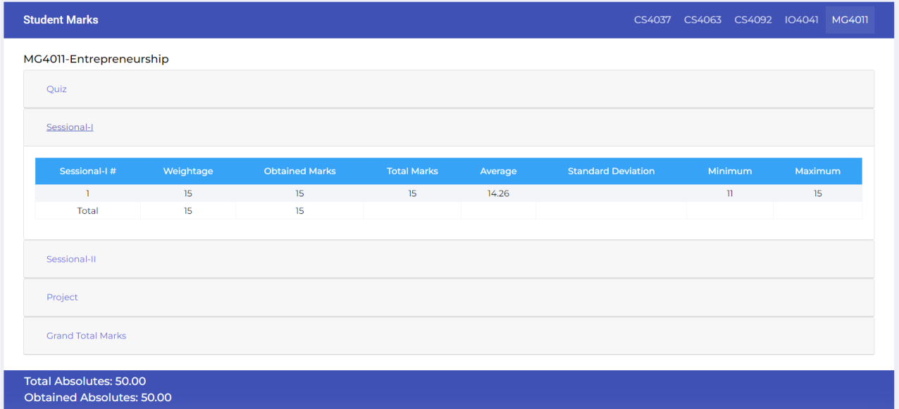

# What Does FlexFix Do?

Flex fix allows you to display the total and obtained absolutes on the FAST NUCES Flex Student Portal. The grand total is usually blank and therefore, this extention enables you to see your progress without having to manually total your marks.




# FlexFix Chrome Extention - Manual Installation Guide

This guide provides step-by-step instructions on how to manually install FlexFix on your Chrome browser. By following these steps, you will be able to enjoy the functionality provided by the extension.


## Prerequisites

Before proceeding with the installation, ensure that you have the following:

- Google Chrome browser installed on your computer.


## Installation Steps

1. Clone the extension repository:

   ```
   git clone https://github.com/mmaarij/FlexFix-Display-Totals-On-Flex-NUCES-Portal.git
   ```
   
   **OR**
   
   Download the repository directly from github by clicking on Code > Download ZIP
   

2. Extract the extension files (if applicable):

   - If the downloaded files are compressed in a zip archive, extract them using a suitable file extraction tool such as WinRAR, 7-Zip, or the built-in tools on your operating system.
   

3. Open Google Chrome:

   - Launch the Google Chrome browser on your computer.
   

4. Access the extensions page:

   - In the Chrome browser, click on the three vertical dots in the top-right corner to open the Chrome menu.
   - From the menu, go to **More Tools > Extensions**. This will open the Extensions page.
   - Alternatively enter the following line into the Chrome address bar:
   ```
   chrome://extensions/
   ```


5. Enable Developer Mode:

   - On the Extensions page, toggle the **Developer mode** switch located at the top-right corner of the page. This will enable the developer features.
   

6. Load the extension:

   - Click on the **Load unpacked** button that appears after enabling Developer mode. This will open a file selection dialog.
   

7. Locate the extension directory:

   - In the file selection dialog, navigate to the location where you saved the extension files or extracted them (Step 1 or Step 2).
   - Select the extension folder "FlexFix" that contains the code files and click **Select** or **OK**.
   

8. Confirm the installation:

   - After selecting the extension directory, Google Chrome will load the extension, and you will see its icon appear in the Extensions toolbar.
   

9. Extension successfully installed:

    - Congratulations! FlexFix has been installed on your Google Chrome browser.
    

## Updating or Removing the Extension

- Repeat steps 1 and 2 to download the updated extension files. Overwrite the existing (older) files in the extension directory. Click on the **Update** button on top of the Extentions page (Step 4).
- To remove the manually installed extension, go to the Extensions page (Step 4) and click on the **Remove** button next to the extension's listing.


## Troubleshooting

If you encounter any issues during the installation process or while using the extension, please feel free to report it.


## Disclaimer

The extension is provided as-is, without any warranty or guarantee of its functionality or suitability for any purpose. Use it at your own risk.
